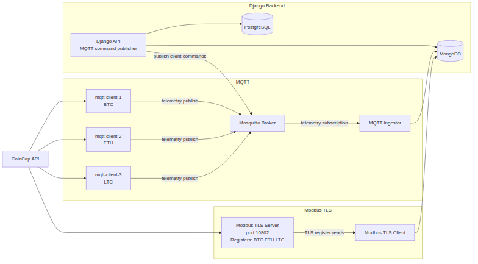
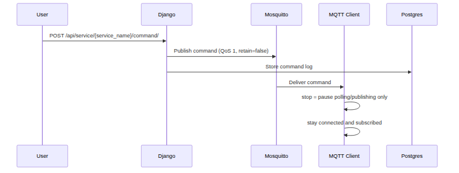

# EASYCON Backend Assignment

Author: Juraj Štibrány 

Welcome to the assignment solution for a Python Backend developer at Easycon. I hope you will find the solution clear, understandable, but most importantly that it will provide a sufficient showcase of my skills. The project shows one end-to-end flow built around two protocols, which fetch the prices of cryptocurrencies (BTC, ETH and LTC):

- Async MQTT is pushed from clients into the broker and then stored by the ingestor.
- Sync Modbus is fetched by the client from the server and then stored as readings.

## Tech Stack

- Python 3.13
- Django 6
- PostgreSQL with `psycopg`
- MongoDB with `pymongo`
- Mosquitto MQTT broker
- Modbus with `pymodbus`
- `uv` for dependency management

## Project Layout

- `backend/` Django project and API
- `services/` runtime workers (`mqtt/client`, `mqtt/ingestor`, `modbus/server`, `modbus/client`)
- `shared/` common helpers and pydantic settings
- `infra/` broker config and cert placeholders
- `docs/` assignment PDF, Mermaid sources, and rendered architecture diagrams
- `scripts/` plotting script for MongoDB data
- `setup-and-flow-notes.md` full logic flow and setup notes

## Architecture

### High-level data flow:

This diagram shows the full runtime split by responsibility.

- CoinCap is the price source for every quote-producing service.
- The three MQTT clients each fetch a single asset from CoinCap and publish telemetry to Mosquitto.
- The MQTT ingestor subscribes to all MQTT telemetry topics and stores the data in MongoDB.
- The Modbus TLS server fetches the same CoinCap prices and writes them into registers.
- The Modbus TLS client reads those registers and stores decoded values in MongoDB.
- Django reads from PostgreSQL and MongoDB, publishes MQTT commands, and exposes the API and dashboard.

- PostgreSQL stores the metadata for the three MQTT clients and the Modbus server, plus the MQTT command history. It keeps the client IDs, asset IDs, symbols, MQTT topic bindings, runtime status, and the command delivery state.
- MongoDB stores the captured quote history for both protocols. MQTT documents keep the client ID, topic, asset ID, symbol, price, polling interval, and timestamps. Modbus documents keep the client ID, server ID, asset ID, symbol, decoded price, register location, status, and timestamps.

I intentionally split the MQTT side into three per-currency clients to show a different shape than the Modbus side.
That makes it clearer to demonstrate:
- MQTT as one producer per asset with command control per client.
- Modbus as one server/client pair with shared register handling.



### MQTT command flow:

This diagram shows how command control works for a single MQTT client.

- The user sends a `POST /api/service/{service_name}/command/` request to Django.
- Django validates the payload and publishes the command to the client-specific MQTT command topic.
- Django stores the command in PostgreSQL as a command log entry.
- The broker delivers the message to the target client.
- The client applies the command locally.
- `stop` disables polling and publishing only.
- `start` re-enables polling and publishing.
- The client stays connected and subscribed the whole time.



## Security Measures

The project is still an assignment/dev setup, but I added the main security pieces around the communication paths and local tooling:

- MQTT runs through the TLS listener on port `8888`.
- Mosquitto has anonymous access disabled.
- Mosquitto ACLs restrict what each actor can do.
- The three MQTT clients can publish only to their own telemetry topic and read only their own command topic.
- The MQTT ingestor can only read telemetry topics.
- Mosquitto requires client certificates, not only username/password authentication.
- MQTT services use CA validation and client certificates generated with `make certs`.
- Modbus communication also uses TLS with a shared CA and separate server/client certificates.
- Django validates MQTT command payloads and only allows `start` and `stop`.
- MQTT command attempts are stored in PostgreSQL, so the dashboard/API has command history and delivery state.

## Setup

0. Before you actually do anything, this project uses `uv` and `docker`, so make sure you have it installed and ready.

1. First, set your .env file. Use .env.example to get all the necessary variables and to those that are missing a default value,
make sure to set it to something.

```bash
cp .env.example .env
uv sync
```

2. TLS and Broker Credentials

Then, generate certs/keys for the MQTT, Modbus and Django services for TLS communication using:

```bash
make certs
```

Create/update Mosquitto users from `.env`:

```bash
make broker-users
```

> NOTE: These are required to run everything, so make sure it is done.

3. Bring up infrastructure and services

You can run everything through docker using, with this all migrations will apply automaticly:

```bash
docker compose up -d
```

or you can run the services manually each in its own process/terminal using for example:

> First bring up the databases (and their web UIs if you want to):

```bash
docker compose up -d postgres mongo mongo-express adminer mosquitto
```

Terminal 1:

```bash
uv run python backend/manage.py runserver
```

Terminal 2:

```bash
make run-ingestor
```

Terminal 3:

```bash
make run-client
```

Terminal 4:

```bash
make run-modbus-server
```

Terminal 5:

```bash
make run-modbus-client
```

4. See what's happening and operate MQTT clients with:

Dashboard:

```text
http://localhost:8000/dashboard/
```

Adminer:

```text
http://localhost:8080/
```

> Do not forget to input credentials from your .env you created the containers with.

or Mongo-Express:

```text
http://localhost:8081/
```

> Here as well, use credentials from .env you created the containers with

## End-to-End API Smoke

```bash
make test-e2e
```

This checks:

- quotes for `mqtt-client-1/2/3`
- command publish from Django (`stop` / `start`) for client 1

## API Endpoints

### `GET /api/mqtt/quotes/`
Returns MQTT telemetry documents from MongoDB.

- Payload: none
- Returns: `{"items": [...], "count": <int>}`
- Query params: `limit`, `client_id`, `asset_id`

### `GET /api/modbus/quotes/`
Returns Modbus quote documents from MongoDB.

- Payload: none
- Returns: `{"items": [...], "count": <int>}`
- Query params: `limit`, `asset_id`

### `GET /api/dashboard/summary/`
Returns the full dashboard payload in one response.

- Payload: none
- Returns: `{"updated_at": "...", "mqtt_clients": [...], "modbus_client": {...}, "modbus_quotes": [...]}`

### `POST /api/service/{service_name}/command/`
Publishes a `start` or `stop` command to one MQTT client.

- Payload: `{"command": "start"}` or `{"command": "stop"}`
- Returns: `{"client_id": "...", "command": "...", "status": "sent", "running": <bool>, "runtime_status": "..."}`

### `GET /api/service/{service_name}/status/`
Returns the current runtime state for one MQTT client or the Modbus client.

- Payload: none
- Returns: `{"client_id": "...", "running": <bool>, "status": "...", "last_command": "..." }`

MQTT clients are controllable via the command endpoint (`start`, `stop`), while Modbus data is read-only in the dashboard.

> NOTE: Right after startup, services might briefly appear as `stale/stopped` until the first poll/write cycle completes and fresh data is stored.

## Dev Checks

The repo checks are driven through `make`:

- `make test` runs the protocol unit tests.
- `make test-django` runs the Django API tests against local Postgres.
- `make test-e2e` runs the smoke flow for quotes and MQTT stop/start.
- `make plot` renders the current MongoDB charts.

If you want direct `uv` commands, use:

```bash
uv run --extra dev pytest tests
uv run --extra dev ruff check backend services shared scripts tests
```
